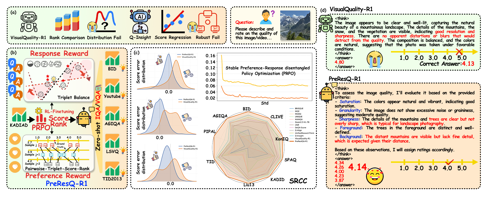
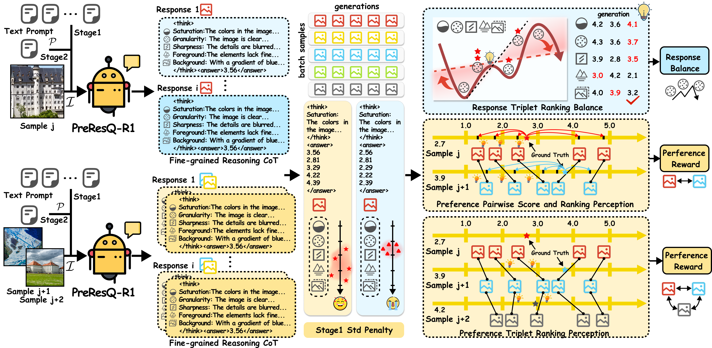

<div align="center">

<h2 style="border-bottom: 1px solid lightgray;">👀✨🖼️PreResQ-R1: Towards Fine-Grained Rank-and-Score Reinforcement Learning for Image Quality Assessment via Preference–Response Disentangled Policy Optimization</h2>
</div>


<!-- Badges and Links Section -->
<div style="display: flex; align-items: center; justify-content: center;">

<p align="center">
  <a href="#">
  <p align="center">
    <a href='https://arxiv.org/'></a>
    <a href='https://danceskycode.github.io/General-Visual-Quality-RL/PreResQ-R1'> </a>
    <a href='https://github.com/DanceSkyCode/General-Visual-Quality-RL/tree/main/Ground-truth'></a>
    <a href='https://huggingface.co/DanceSkyCode/PreResIQA-R1'></a>
  </p>
</p>

</div>

<br/>


<div align="center">
<!--  -->
<div>
  
</div>

</div>

🏁 Method Overview. (a) Existing score/ranking reward function assign minimal difference, which results in distribution fall or robustness fail. (b) PreResIQA-R1 focus on fine-grained response-ranking reward balance and preference. (c) PreResIQA-R1 enables state-of-the-art performance and stable image quality assessment with discriminative reward. (d) typical qualitative and quantitative example comparison between VisualQuality-R1 and PreResIQA-R1, which demonstrates superior performance on image quality describe and score.

<div align="center">
<div>

</div>
</div>

🏁 Overall training framework of PreResIQA-R1 via reinforcement-learning-to-rank-score (RL2RS). Given an image batch with a shared text prompt, PreResIQA-R1 generates K responses. To quickly activate CoT differences and then access generation stability, we introduce the response penalty and fine-grained triplet-response balance reward. To jointly enhance the robustness of ranking and score ability, we introduce the preference pairwise-and-triplet score-and-ranking reward for GRPO.


<div align="center">
<div>

</div>
</div>
🏁 Pipeline of the Preference-Response Disentangled Policy Optimization (PRPO), which applies response ranking response balance reward, and preference pairwise score and ranking reward, and preference triplet ranking reward to optimize group policy learning.


<!-- ## News -->
<h2 style="border-bottom: 1px solid lightgray; margin-bottom: 5px;">✨ Update</h2>

[2025/10/30] 💻💻💻 We release the training and inference code of **PreResVQA-R1** on video quality assessment. To extend beyond static imagery, we introduce a global–temporal and local–spatial data flow strategy. With only 28K samples, it achieves state-of-the-art performance across 5 VQA datasets while providing interpretable CoT process.

[2025/10/27] 🤗🤗🤗 We release [[**PreResIQA-R1-7B**](https://huggingface.co/DanceSkyCode/PreResIQA-R1)] fine-tuned on the Qwen2.5-VL-7B-Instruct.

[2025/10/23] 💻💻💻 We release the training and inference code of **PreResIQA-R1** on image quality assessment, a preference–response disentangled reinforcement learning framework that unifies score regression and ranking consistency via reasoning-driven optimization. With only 6K samples, it achieves state-of-the-art performance across 10 IQA datasets while providing interpretable CoT process.


<!-- ## Environment setup -->
<h2 style="border-bottom: 1px solid lightgray; margin-bottom: 5px;">🔧Environment setup</h2>

quickly create a conda environment that contains the packages necessary to run our scripts on A100 and A800 GPUs.

```
conda create -n PreResQ python=3.11
conda activate PreResQ

bash setup.sh
```


<!-- We will release the processed data (such as THINGS-EEG1, THINGS-EEG2, THINGS-MEG, THINGS-fMRI) on [Huggingface], which can be directly used for training.
 -->


<!-- ## Quick training and test  -->
<h2 style="border-bottom: 1px solid lightgray; margin-bottom: 5px;">🚀Quick Training and Inference</h2>


#### 1.Quick Reinforcement-Learning Fine-Tuning Start
For IQA task:
```
bash run_scripts\KADID-10K\one_node_run_KADID_PreResIQA_R1.sh
--model_name_or_path [ Qwen2.5-VL-7B-Instruct path] \
--image_folders [dataset images path] \
--data_file_paths [JSON MOS_Ground_Truth file path] \
```
For VQA task:
```
bash run_scripts\KADID-10K\one_node_run_LSVQ_PreResVQA_R1.sh
--model_name_or_path [ your PreResIQA-R1 path] \
--image_folders [dataset images path] \
--data_file_paths [JSON MOS_Ground_Truth file path] \
```
#### 2.quick batch sample inference
For IQA task:
```
python src\inference_PreResIQA_R1.py
--MODEL_PATH [ PreResIQA-R1_path] \
--image_root_path [ test_image_root_path] \
--output_root_path [ output_root_path]
```
For IQA task:
```
python src\inference_PreResVQA_R1.py
--MODEL_PATH [ PreResVQA-R1_path] \
--image_root_path [ test_image_root_path] \
--output_root_path [ output_root_path]
```

<!-- ## Acknowledge -->
<h2 style="border-bottom: 1px solid lightgray; margin-bottom: 5px;">😺Acknowledge</h2>

We sincerely thank the following outstanding works and contributors:  


1. **Reasoning-Induced Image Quality Assessment via Reinforcement Learning to Rank**.   Authors: Tianhe Wu, Jian Zou, Jie Liang, Lei Zhang, Kede Ma.  

2. **VLM-R1: A stable and generalizable R1-style Large Vision-Language Model**  Authors: Haozhan Shen, Peng Liu, Jingcheng Li, Chunxin Fang, Yibo Ma, Jiajia Liao, Qiaoli Shen, Zilun Zhang, Kangjia Zhao, Qianqian Zhang, Ruochen Xu, Tiancheng Zhao

---

# 🏷️ License
This repository is released under the MIT license. See [LICENSE](./LICENSE) for additional details.